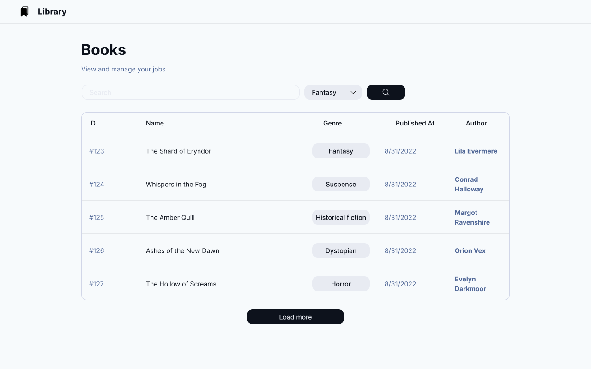

# backend-frontend-test
Backend and frontend technical test

# Title
You are developing a Library Analytics Platform that integrates two databases: one for Books and one for Authors. The system should include advanced backend operations, SQL function development, and a React-based frontend for interacting with the system.

## Backend requirements (TypeScript)

- Use an ORM (e.g., TypeORM, Prisma, Sequelize) to manage two databases:
  - Database 1: Books (fields: id, title, authorId, genre, publishedYear).
  - Database 2: Authors (fields: id, name, birthYear, nationality).
- If you require additional tables, feel free to add them.
- Create a script to initialize and seed both databases with realistic data (e.g., at least 100 authors and 5000 books).
- Properly define database relationships (e.g., one-to-many between authors and books).
- Implement authentication middleware to protect the API endpoints.
- If you require aditional endpoints, feel free to add them.

### Basic endpoints:
- Fetch all books with their author details and genre. Support pagination and filtering by genre.
  ```http
  GET {{base}}/api/books
  Content-Type: application/json
  ```
  
- Fetch all authors, including the number of books they’ve written.
  ```http
  GET {{base}}/api/authors
  Content-Type: application/json
  ```

- Retrieve the number of books grouped by genre and the average publication year for each genre. This should leverage a custom SQL function.
  ```http
  GET {{base}}/api/books/genre-stats
  Content-Type: application/json
  ```

- Add a new book. Validate that the author exists and enforce constraints (e.g., books must have a valid genre from a predefined list).
  ```http
  POST {{base}}/api/books
  Content-Type: application/json
  ```

- Retrieve detailed information about a single book and their author information.
  ```http
  GET {{base}}/api/books/:id/details
  Content-Type: application/json
  ```
  Write a SQL function to retrieve the following information:
  - Book data
  - Author data
  - Author added data:
    - Books they've written.
    - Average publication year of their books.
    - A calculated "Author Impact Score"
      Formula: `(Total Books Written * 10) + (Current Year - Average Book Publication Year).`

---
## Frontend requirements (React):

- Use React with TypeScript and a modern build tool (e.g., Vite, Next).
- Include state management
- Display all books with author details and genres in an infinite paginated view.
- Filter books by genre.
- Search for books by title.
- Visualize data from the `{{base}}/api/books/:id/details` endpoint.
- Follow the basic design

### Design
[Figma design](https://www.figma.com/design/2ir4rNsy6tbv0KWjlLzYcE/Backend-frontend?node-id=18-136&node-type=frame&t=cfTw9OfnebIqkeWX-0)



### Bonus points:
- Add a book called "The way of kings" by "Brandon Sanderson" with a publication year of 2010.

### Submission
- Create a private GitHub repository with the code using this template and invite the user `@Noel-S` and `@MartinChavez-Ikigo` as a collaborator.
- Include a README file with instructions on how to run the backend and frontend.
- Deploy the backend and frontend to a cloud provider (e.g., Heroku, Vercel, Netlify).
- Create a release in the github repository with the deployed URLs in the description and the tag `1.0.0`.

### Evaluation criteria
- Code quality
- Database design
- API design
- Frontend design
- Functionality
